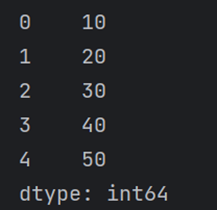
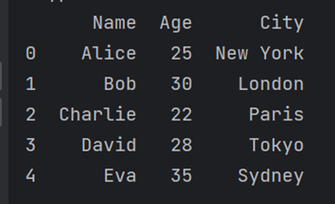

## Specialism Homework (Week 1)

### Question 1
*In no more than 500 words, explain the differences between a Jupyter Notebook (.ipynb extension) and a Python file (.py extension). Focus on the advantages and disadvantages of one or the other, particularly for data analysts/scientists. You are encouraged to use examples and screenshots of the different scripts to support your arguments.*

**Answer:**
Jupyter Notebook is an interactive computing environment that allows users to create and share documents that combine code, visualisations, and explanatory text. It is popular among data analysts for its ability to weave code and narrative together, making it an ideal choice for exploratory data analysis, visualisation, and collaborative research.

There are many advantages to Jupyter Notebook, such as; interactivity, Jupyter Notebook enables interactive execution of code cells. This feature facilitates an iterative approach to data analysis, where users can execute individual code blocks and see the output immediately. This interactivity makes debugging and testing code snippets easier; Data Visualization, Jupyter Notebook allows for seamless integration of data visualisation libraries like Matplotlib, Seaborn, and Plotly. This integration empowers data analysts to create rich, interactive visualisations within the same environment as their code and analysis; Markdown Support, Including markdown cells, allows data analysts to document their thought processes, add explanations, and provide context for their code. This feature is especially helpful when sharing results or collaborating with others; Integration with Other Languages, Jupyter Notebooks are not limited to Python; they support a wide range of programming languages like R, and Julia.

There are also disadvantages, such as; Version Control and Difficult Collaboration, Jupyter Notebooks can be challenging to manage in version control systems like Git. The JSON-based nature of .ipynb files can lead to conflicts, making collaborative work more complex.; Long-term Maintenance, Jupyter Notebooks can become unwieldy as they grow in size. They lack the modular structure of Python files, making code organisation and maintenance more difficult in the long run.

A Python file with the .py extension contains executable Python code. It is the standard way of organising and sharing Python code and is widely used in software development and large-scale projects.

There are many advantages of Python, such as; Code Reusability and Modularity, Python files promote code reusability and modularity. Functions and classes can be defined in separate files, allowing data analysts to build libraries and packages for specific tasks or data processing steps; Version Control and Collaboration, Python files integrate seamlessly with version control systems like Git, making collaboration with team members more manageable. Changes and contributions can be tracked easily, and merging conflicts is straightforward; Automation and Reproducibility Python files are more suitable for building automated data pipelines and reproducible data analysis. They can be executed directly from the command line or scheduled as part of batch processes.

There are also many disadvantages, such as Limited Interactivity, Unlike Jupyter Notebooks, Python files lack the interactive execution of code cells. Data analysts must rely on print statements or logging to see intermediate outputs. Data Visualization Challenges Python files can create data visualisations. Still, they may require more code and effort to produce interactive visualisations.

In summary, Jupyter Notebooks (.ipynb) are excellent for data exploration, visualisation, and sharing research findings, providing an interactive and narrative-driven environment. On the other hand, Python files (.py) are better suited for building reusable and maintainable code, automating data workflows, and collaborating on larger projects.

### Question 2	 [10 points]
*What is the difference between a Pandas DataFrame and a Pandas series. Show an example of how you create each of them.*

**Answer:**

Pandas Series is a one-dimensional labelled array, while Pandas DataFrame is a two-dimensional labelled data structure with rows and columns. A Series represents a single column of data with an associated index, while a DataFrame comprises multiple columns, each represented as a Series, sharing a standard index for rows. bSeries are suitable for handling one-dimensional data, while DataFrames are ideal for working with tabular data and integrating multiple columns of data.

Example of creating Pandas Series:

`import pandas as pd`

`# Creating a Pandas Series from a list
data_list = [10, 20, 30, 40, 50]
series_from_list = pd.Series(data_list)`

`print(series_from_list)`

Output:

Example of creating Pandas Dataframe:

`import pandas as pd`

`# Creating a Pandas DataFrame from a dictionary
data_dict = {
    'Name': ['Alice', 'Bob', 'Charlie', 'David', 'Eva'],
    'Age': [25, 30, 22, 28, 35],
    'City': ['New York', 'London', 'Paris', 'Tokyo', 'Sydney']
}
df_from_dict = pd.DataFrame(data_dict)`

`print(df_from_dict)`

Output:

### Question 3	 [10 points]
* Starting from the argument that a Pandas DataFrame represents rectangular data, use the internet and other resources to describe in no more than a few sentences the difference between rectangular and non-rectangular data. *

**Answer:**

In the context of data representation, a Pandas DataFrame represents rectangular data, which means that it organizes data into rows and columns forming a tabular structure. Each row corresponds to a record or observation, and each column represents a specific variable or attribute. The format is similar to a spreadsheet or SQL.

In contrast, non-rectangular data does not adhere to the tabular structure of rows and columns. Instead, it encompasses data structures where the elements are not organised into a well-defined matrix or table. Non-rectangular data formats include hierarchical data structures like JSON, nested dictionaries, or arrays of varying lengths, where the data may have irregular shapes or nested levels. These often represent complex relationships, nested data, or hierarchical structures that cannot be easily represented flat or tabularly.

### Question 4	 [10 points]
* Starting from the data visualisation usage from Session 2, give examples of when figures could be:

a.	Of use to the data scientist to identify patterns in the data/highlight the essential parts of a data set;
b.	Tell a story and create business presentations.*

**a.**
Line Plots: Line plots are helpful for visualising trends and patterns over time. Data scientists can use line plots to identify trends, seasonality, or anomalies in time-series data, such as stock prices, temperature variations, or website traffic.

Scatter Plots: Scatter plots help visualise relationships and correlations between two numerical variables. Data scientists can use scatter plots to identify data patterns, clusters, or outliers. For example, scatter plots can reveal how two variables are related.

Heatmaps: Heatmaps are excellent for displaying the magnitude of values in a two-dimensional dataset. Data scientists can use heatmaps to identify patterns and trends in large datasets.

Box Plots: Box plots effectively visualise data distribution and identify outliers. Data scientists can use box plots to compare the distributions of multiple groups or categories and highlight differences in the data.

**b.**

Bar Charts: Bar charts are ideal for comparing categorical data or showing frequency distributions. In business presentations, bar charts can present survey results, market share, or sales data for different products or regions.

Pie Charts: Pie charts help display the proportions and percentages of a whole. In a business context, pie charts can represent the composition of a company's revenue, expenses, or market share by product categories.

Area Charts: Area charts help show the cumulative totals over time and compare trends between groups. In business presentations, area charts can be used to demonstrate sales or revenue growth over time for different product lines.

Stacked Bar Charts: Stacked bar charts help visualise the composition of multiple categories over time or across different segments. In business presentations, stacked bar charts can show the contribution of various factors to the overall result, such as revenue breakdown by different sales channels or marketing expenses by different media channels.

Infographics: Infographics combine data visualisations and textual elements to tell a compelling story. Data scientists and business professionals can create infographics to present complex information in a visually appealing and easy-to-understand format.
